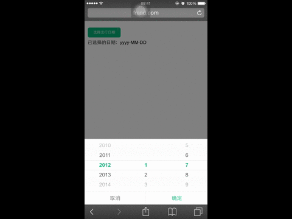
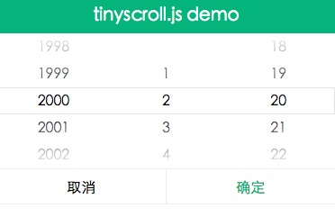

# Tinyscroll.js  

> A tiny datetime scroller plugin for mobile device, dependencies on jquery and animate.css.

**gif demo, loading . . .**



## Usage

```js

var ts;
if (!ts) {
    // init `ts`
    ts = new TinyScroll({
        wrapper: '#container',
        needLabel: true,
        range: ['2010/03/09 12:30:00', '2015/01/01 23:00:00'],
        time: true,
        initDate: '2011/07/20 18:30:00',
        cancelValue: '取消',
        okValue: '确定',
        okCallback: function(date) {
            alert(date);
        }
    });
} else {
    // if the `ts` is defined
    ts.showScroller();
}

```

## Props

- **wrapper**

> root element to wrap datetime scroller

- **title** (optional)

> datetime scroller title

- **needLabel** (optional)

> show the section label: year, month, day, hour and minute

- **range**

> date range: `['2010/03/09 12:30:00', '2015/01/01 23:00:00']` or `[new Date('2010/03/09 12:30:00'), new Date('2015/01/01 23:00:00')]`.

> Attention: If the date is `String`, it's format must be `yyyy/MM/DD hh:mm:ss`.

- **time** (optional)

> show time scroller, default false



- **initDate** (optional)

> initialize date: `'2011/07/20 18:30:00'` or `new Date('2011/07/20 18:30:00')`.

> Attention: If the date is `String`, it's format must be `yyyy/MM/DD hh:mm:ss`.

- **year** (optional)

> initialize `stateTree.year`

- **month** (optional)

> initialize `stateTree.month`

- **day** (optional)

> initialize `stateTree.day`

- **hour** (optional)

> initialize `stateTree.hour`

- **minute** (optional)

> initialize `stateTree.minute`

- **cancelValue** (optional)

> cancel button text

- **okValue** (optional)

> ok button text

- **okCallback**

> click ok button callback function

## API

- **showScroller**

> when the `ts` is defined, should not init it again, just invoke the method to show it

## Demo

- **online**

[http://frender.github.io/tinyscroll.js](http://frender.github.io/tinyscroll.js)

- **local**

```js

git clone https://github.com/FrendEr/tinyscroll.js.git
cd tinyscroll.js
npm install
open index.html

```

## Installation

```js

npm install tinyscroll.js [--save[-dev]]

```
