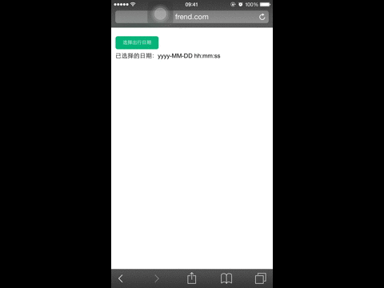

# Tinyscroll.js

> A tiny date scroller plugin for mobile device.

**gif demo, loading . . .**



## Props

- **wrapper**

> root element to wrap date scroller

- **title** (optional)

> date scroller title

- **needLabel** (optional)

> show the section label: year, month and day

- **range**

> date range, ['2010', '2015'] etc.

- **initDate** (optional)

> initialize date, '2012-08-01' etc.

- **year** (optional)

> initialize `stateTree.year`

- **month** (optional)

> initialize `stateTree.month`

- **day** (optional)

> initialize `stateTree.day`

- **cancelValue** (optional)

> cancel button text

- **okValue** (optional)

> ok button text

- **okCallback**

> click ok button callback function


## Usage

```js

var ts = new TinyScroll({
    title: 'tinyscroll.js demo',
    wrapper: '#container',
    range: ['2000-08-10', '2016-05-06'],
    initDate: '2012-07-20'
});

```

## Run demo

```js

git clone https://github.com/FrendEr/tinyscroll.js.git
cd tinyscroll.js
open index.html

```

## Installation

```js

npm install tinyscroll.js [--save[-dev]]

```
